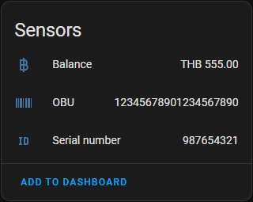

# Thai Easy Pass integration for Home Assistant

Home Assistant custom component to integrate data from Thai Easy Pass. The integration provides the following sensors:

- Balance
- Serial Number
- OBU

## Screenshot

## Installation

### HACS (recommended)

This integration can be installed via HACS.
1. Click here  to add this repository to your Home Assistant instance.
1. In the repository page click *Download*.
1. Restart Home Assistant.

### Manual installation

1. Using the tool of choice open the directory (folder) for your HA configuration (where you find `configuration.yaml`).
1. If you do not have a `custom_components` directory (folder) there, you need to create it.
1. In the `custom_components` directory (folder) create a new folder called `thai_easy_pass`.
1. Download _all_ the files from the `custom_components/thai_easy_pass/` directory (folder) in this repository.
1. Place the files you downloaded in the new directory (folder) you created.
1. Restart Home Assistant.

## Configuration

1. In the HA UI go to "Configuration" -> "Integrations" (or click here )
1. Click "+" and search for "Thai Easy Pass"
1. Enter your login credentials that you use to login to [thaieasypass.com][thaieasypasscom]

# Coffee

[hacs]: https://hacs.xyz/
[thai_easy_pass]: https://github.com/saxel/ha-thai-easy-pass
[thaieasypasscom]: https://thaieasypass.com
